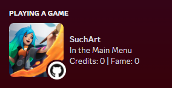
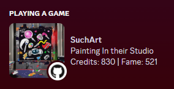
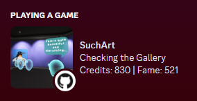

# SuchPrecense - Discord Rich Presence for SuchArt

This is a simple Discord Rich Presence plugin for [SuchArt- Genius Artist Simulator](https://store.steampowered.com/app/1293180/SuchArt_Genius_Artist_Simulator/) and [BepInEx](https://github.com/BepInEx/BepInEx). It shows you where you are, your fame, and your money.

## Installation

0. Have discord and the game (duh)
1. Download [BepInEx_x64](https://github.com/BepInEx/BepInEx/releases/tag/v5.4.21) and unzip into the root of the game directory.
2. Run the game once to generate the files needed.
3. Download the latest release of the mod
4. Unzip the release into the game directory. 

Discord should automatically detect the game and show what's going on.

### Note

This only has been tested on the [paid Steam version of the game](https://store.steampowered.com/app/1293180/SuchArt_Genius_Artist_Simulator/). No idea if the Epic Games or Creative version works. If you have one of those versions, please let me know.

## Screenshots

|Main menu|Being in the studio|Visiting the gallery|
|---	|---	|---	|
|||   	|

## Contributing

You can contribute by opening an issue or making a pull request. This mod is more or less an excuse to learn C# and modding Unity games.

### Development

You'll need to source the Assembly-CSharp.dll from the game. You can do this by copying it from the game directory into the `lib` folder. Sourcing it myself would probably be illegal.

Building is done using `dotnet build` in the root directory.

## License

I'm using [MIT](https://choosealicense.com/licenses/mit/)

### Credits

- [BepInEx](https://github.com/BepInEx/BepInEx)
- [DiscordSDK](https://discord.com/developers/docs/game-sdk/sdk-starter-guide)
- [SuchArt](https://store.steampowered.com/app/1293180/SuchArt_Genius_Artist_Simulator/)

## TODOs

- Setup pipelines for releases